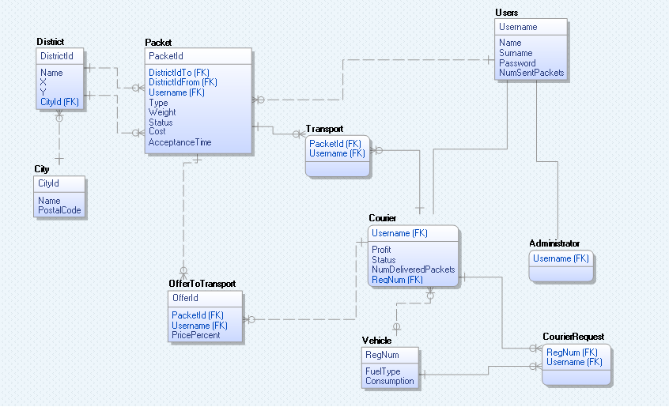

# Package-Transportation-System
System for package transportation - Project for Database Management Tools Course (School of Electrical Engineering 2021)

Technologies used:
* Java 13
* JDBC
* MSSQL

In documentation folder is description of all implemented interfaces.
